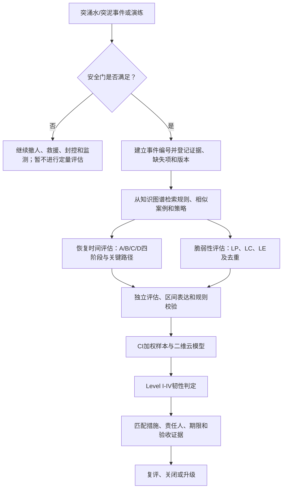

# 隧道施工突涌水灾害韧性评估现场实施指南

[English summary](README_EN.md)

本仓库将论文 *Intelligent resilience assessment of water inrush in tunnel construction based on mixture of experts-LLMs system* 及其两个配套开源项目，转化为施工现场可执行、可复核、可留痕的实施指南。

它面向项目经理、总工程师、安全负责人、应急管理人员、造价人员和评估工程师，提供：

- 从事故资料采集到韧性等级判定的标准作业流程；
- 恢复时间与脆弱性评估表单；
- 证据、假设、缺失信息和置信度登记方法；
- 多名专家/LLM评估结果的 CI 加权与二维云模型计算工具；
- 韧性提升措施、责任人、期限和闭环验收表；
- 一套可重复运行的匿名演示案例。

> [!CAUTION]
> 本指南是工程决策支持工具，不替代应急预案、人员搜救、监测预警、停工撤人、专项施工方案、法定事故报告、设计复核或有资质单位的专业判断。事故发生后，人员生命安全和次生灾害控制始终优先。只有现场指挥机构确认具备评估条件后，才进入本指南的定量评估步骤。

## 现场最快用法

1. 打开 [`docs/quick-start.md`](docs/quick-start.md)，先执行安全门和15分钟初始登记。
2. 复制 [`templates/`](templates/) 下的表单到本次事件文件夹。
3. 按证据编号 `E01、E02...` 登记所有已知信息、来源、单位和状态。
4. 分别执行恢复时间和脆弱性工作流，不得由同一个结论反推输入。
5. 至少由两名相互独立的评估者完成评价；正式部署建议包含领域专家。
6. 运行：

   ```bash
   python tools/field_assessment.py examples/example-assessment.json --pretty
   ```

7. 由评估负责人复核自动校验结果、二维云模型等级和对应措施。
8. 将最终结果填入 [`templates/final-report.md`](templates/final-report.md)，经审批后发布。

## 实施流程



## 核心量化口径

恢复时间：

```text
Time = TA + TB + TC + TD
```

- `TA`：应急响应、人员撤离和风险消除；
- `TB`：排水、清淤、装运和合规处置；
- `TC`：供电、通风、排水系统及关键设备恢复；
- `TD`：地层加固、工法调整、验证、复工审批和施工组织恢复。

存在并行活动时，必须建立重叠台账并按关键路径计时，不能重复累计。

脆弱性：

```text
Loss = LP1 + LP2/3 + LP3/60
     + (LC1 + LC2 + LC3 + LC4)/400 + LE
```

其中：

- `LP1/LP2/LP3`：死亡、重伤、轻伤人数；
- `LC1`：排水清淤费用；
- `LC2`：设备损失；
- `LC3`：材料和已完工程损失；
- `LC4`：不与前三项重复的工期延误损失；
- `LC` 单位统一为万元人民币；
- `LE` 取 `0、0.5、1、3、10`。

维度分级边界如下：

| 维度等级 | 恢复时间 Time（月） | 脆弱性 Loss |
| --- | ---: | ---: |
| 1 | `[0, 0.33)` | `[0, 1)` |
| 2 | `[0.33, 1)` | `[1, 3)` |
| 3 | `[1, 3)` | `[3, 10)` |
| 4 | `[3, 9)` | `[10, 30)` |
| 5 | `[9, 24]` | `[30, 100]` |

物理恢复时间超过24个月时应保留原估计，同时将云模型输入截断为24个月并明确标记。`Loss > 100` 时不得静默截断，应标记为超出参考域并按项目批准规则处理。

## 仓库内容

| 路径 | 用途 |
| --- | --- |
| [`docs/field-implementation-guide.md`](docs/field-implementation-guide.md) | 完整现场实施手册 |
| [`docs/quick-start.md`](docs/quick-start.md) | 事故后快速启动卡 |
| [`docs/deployment.md`](docs/deployment.md) | 项目部署、知识图谱和离线准备 |
| [`docs/training-and-drills.md`](docs/training-and-drills.md) | 培训、桌面推演和验收要求 |
| [`templates/`](templates/) | 可复制的登记表、台账和报告模板 |
| [`examples/`](examples/) | 匿名演示案例及计算输入 |
| [`tools/field_assessment.py`](tools/field_assessment.py) | 区间、分级、CI加权和二维云模型工具 |
| [`tests/`](tests/) | 计算规则的自动化测试 |

## 与另外两个开源项目的关系

- [tunnel-water-mud-inrush-resilience-kg](https://github.com/Huaiyuan-Sun/tunnel-water-mud-inrush-resilience-kg)：提供指标、规则、案例、等级和策略的知识图谱。
- [tunnel-resilience-assessment-workflows](https://github.com/Huaiyuan-Sun/tunnel-resilience-assessment-workflows)：提供恢复时间和脆弱性的结构化评估工作流。
- 本仓库：规定现场由谁、在何时、使用哪些表单、按什么门槛执行上述方法，并把结果转化为责任明确的行动闭环。

## 结果状态

每次评估必须使用以下状态之一：

- `Assessable`：关键输入足以形成可复核的点值或区间；
- `Provisional`：可形成有工程边界的临时结果，但关键资料仍待补充；
- `Not assessable`：无法为主导项建立合理边界；
- `Suspended`：安全条件、数据完整性或审批条件不允许继续。

任何 `Not assessable` 或未关闭的强制校验失败，都不得被包装成正式韧性等级。

## 版本与引用

当前版本：`v1.0.0`

引用信息见 [`CITATION.cff`](CITATION.cff)。本仓库采用 [MIT License](LICENSE)。

